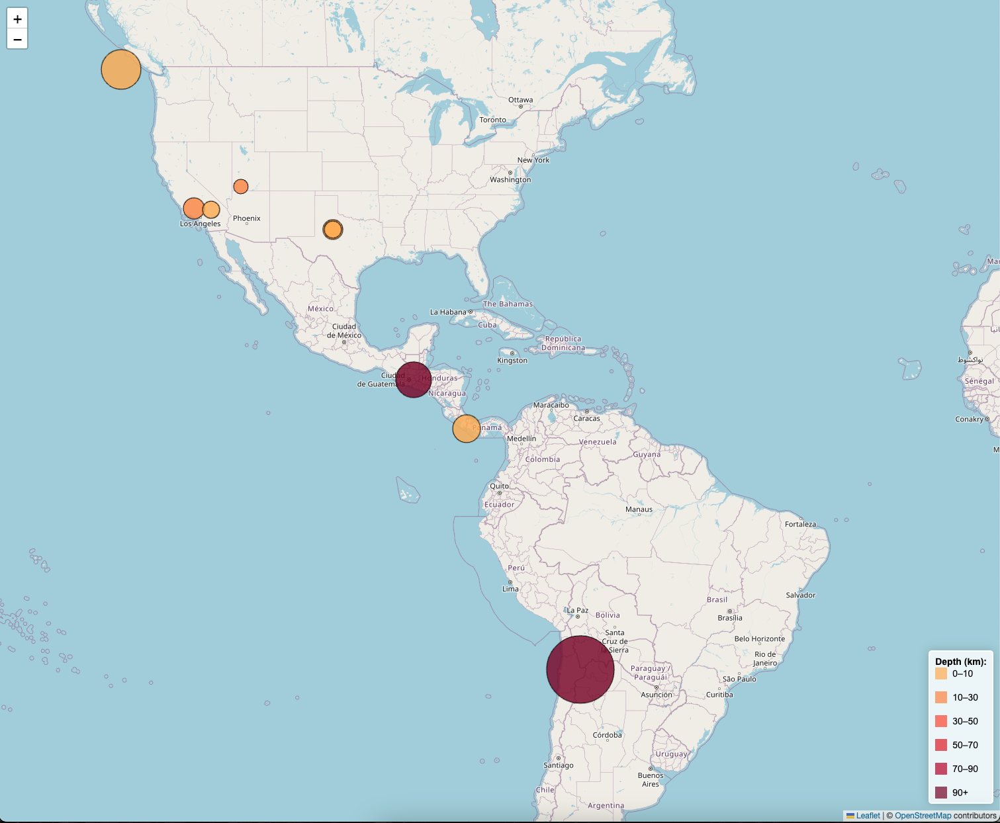

# leaflet-challenge

For this assignment, I created an interactive map with HTML and JavaScript. The map is connected to a geojson API to show all the signaficant earthquakes from the last 30 days. Each marker has an interactive tooltip showcasing the magnitude, location, and depth.

